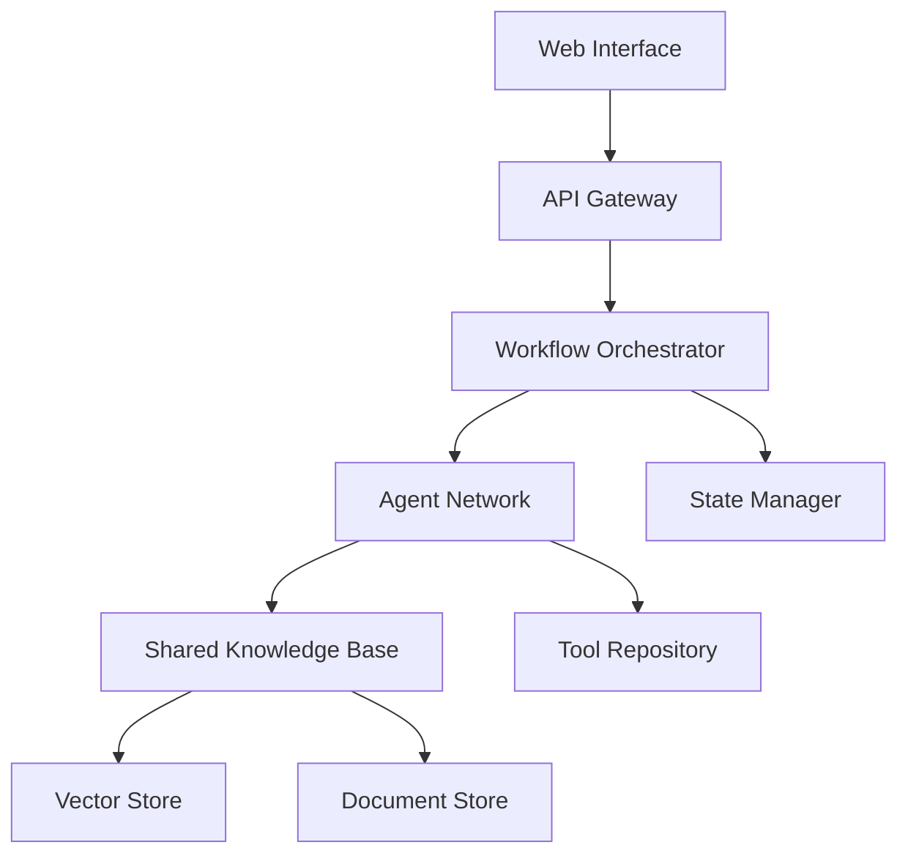
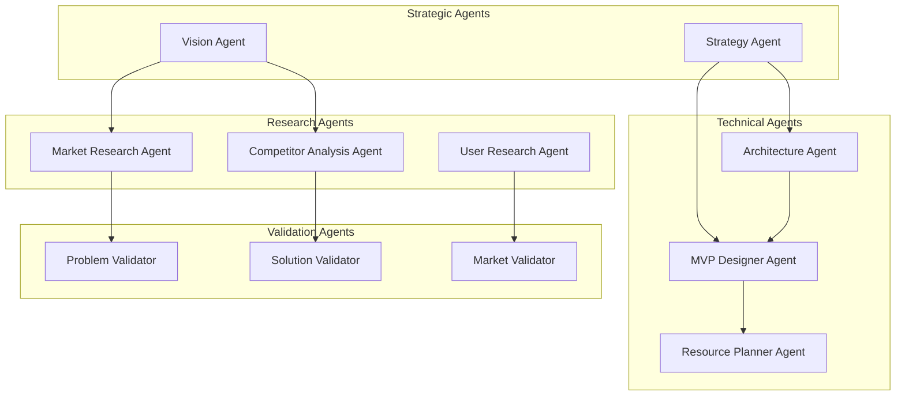
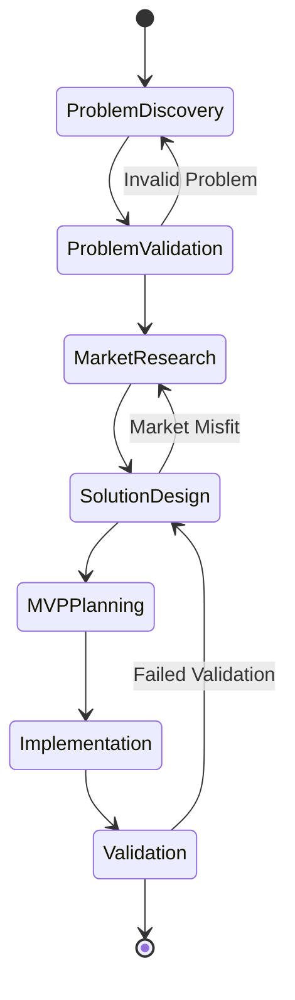
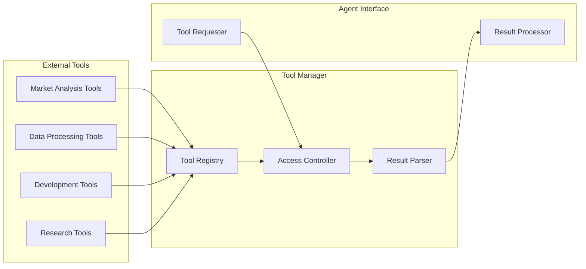
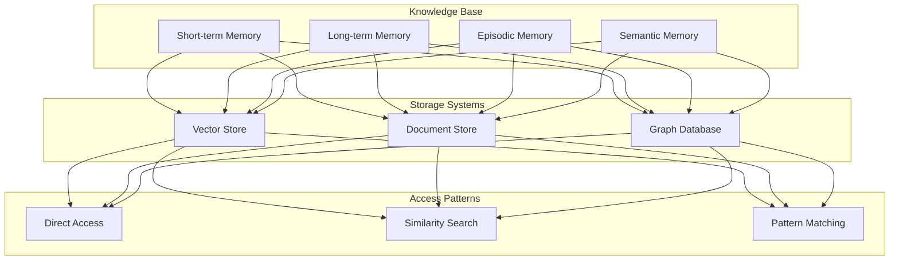
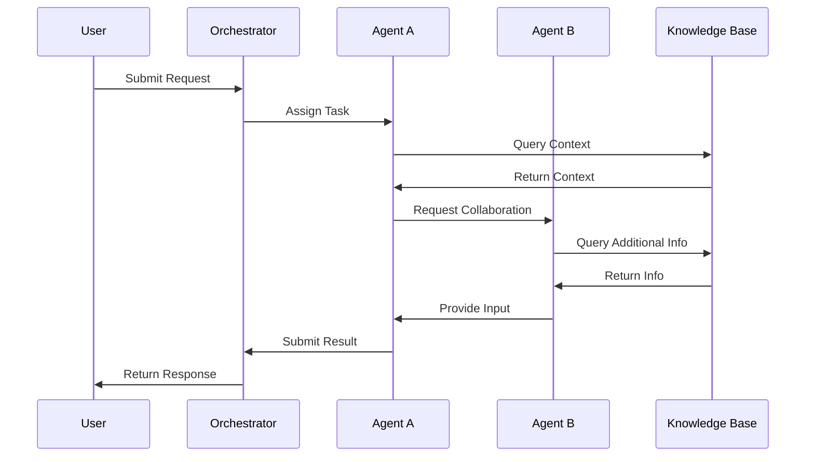
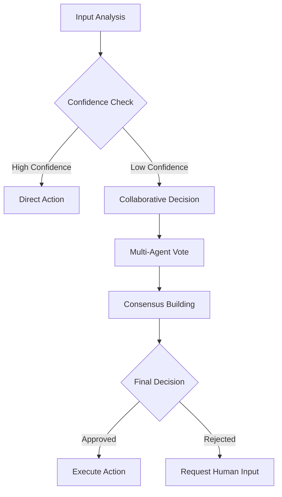

# Agent System Architecture

## System Overview

## Agent Network Structure

## Workflow States

## Tool Integration Framework

## Memory and Knowledge Management

## Agent Capabilities Matrix

| Agent Type | Primary Tools | Memory Access | External Integrations |
| --- | --- | --- | --- |
| Vision Agent | Market Analysis, Trend Detection | Long-term, Semantic | Industry DBs |
| Strategy Agent | Planning Tools, Risk Analysis | All Memory Types | Financial APIs |
| Market Research | Data Mining, Analytics | Semantic, Episodic | Market Data APIs |
| Technical Agent | Code Analysis, Architecture | Long-term, Semantic | Dev Tools |
| Validation Agent | Testing Tools, Metrics | All Memory Types | Validation Frameworks |

## Communication Protocols

## Decision Making Framework

## Tool Categories

### Research Tools

- Market Analysis Tools
- Competitor Research
- User Research Tools
- Trend Analysis
- Patent Research

### Technical Tools

- Architecture Analysis
- Code Generation
- Performance Testing
- Security Analysis
- Resource Estimation

### Validation Tools

- Problem Validation
- Solution Validation
- Market Validation
- Technical Validation
- User Validation

## State Management

### Core States

1. Problem Discovery
2. Problem Validation
3. Market Research
4. Solution Design
5. MVP Planning
6. Implementation
7. Validation

### State Transitions

- Forward Progress
- Iteration Loops
- Validation Gates
- Recovery Paths

## Memory Management

### Memory Types

1. **Short-term Memory**
    - Current context
    - Active tasks
    - Recent interactions
2. **Long-term Memory**
    - Historical decisions
    - Pattern recognition
    - Best practices
3. **Episodic Memory**
    - Past projects
    - Success/failure cases
    - User interactions
4. **Semantic Memory**
    - Domain knowledge
    - Technical concepts
    - Market understanding

## Integration Points

### External Systems

- Market Data APIs
- Development Tools
- Analytics Platforms
- Research Databases
- Validation Services

### Internal Systems

- Knowledge Base
- Vector Store
- Document Store
- Graph Database
- Tool Repository

## Key Performance Indicators

### System Performance

- Response Time
- Decision Accuracy
- Resource Utilization
- Error Rates

### Business Metrics

- Ideas Processed
- Validation Accuracy
- Time to MVP
- Success Rate

## Security Framework

### Access Control

- Role-based Access
- Tool Usage Limits
- Data Privacy
- Audit Logging

### Data Protection

- Encryption
- Secure Storage
- Safe Communication
- Version Control

## Implementation Guidelines

### Priority Order

1. Core Infrastructure
2. Basic Agents
3. Tool Integration
4. Memory Systems
5. Advanced Features

### Quality Assurance

- Automated Testing
- Performance Monitoring
- Security Audits
- User Feedback

This architectural overview provides a comprehensive framework for building the agent-based system, focusing on modularity, scalability, and maintainability. Each component is designed to work independently while maintaining strong integration capabilities through well-defined interfaces and protocols.