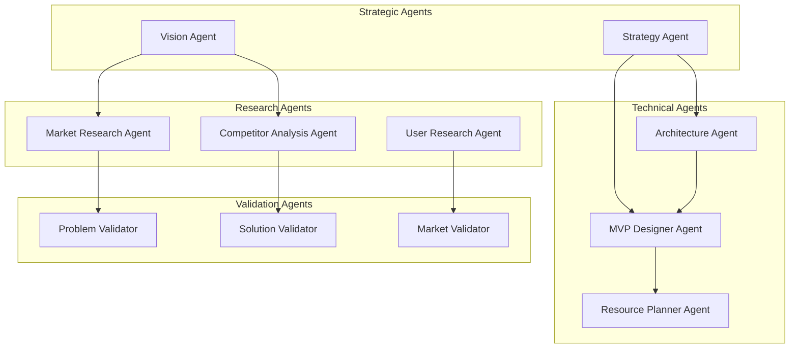
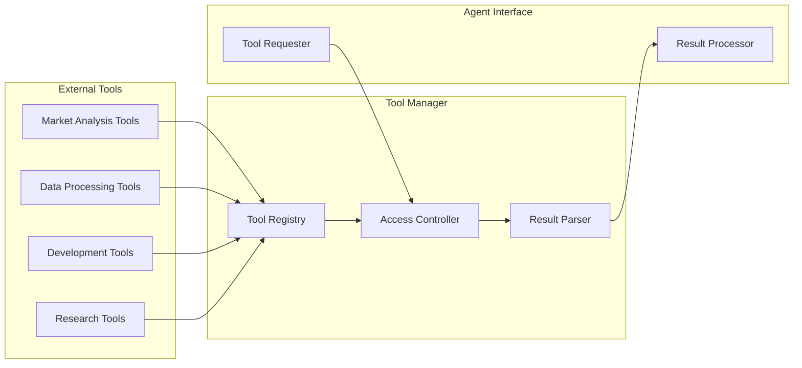
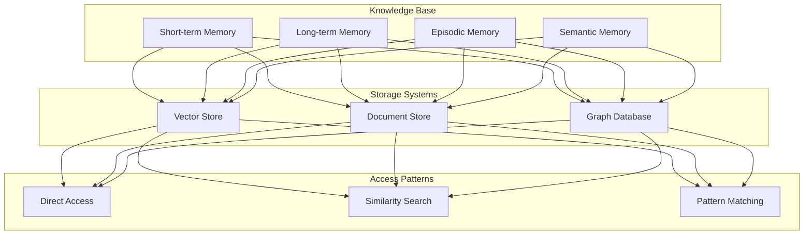
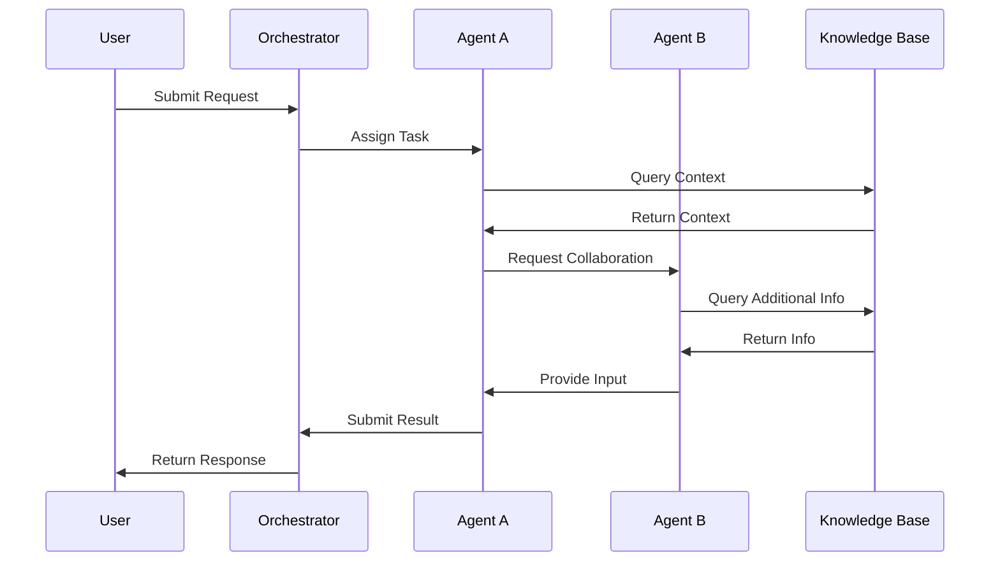
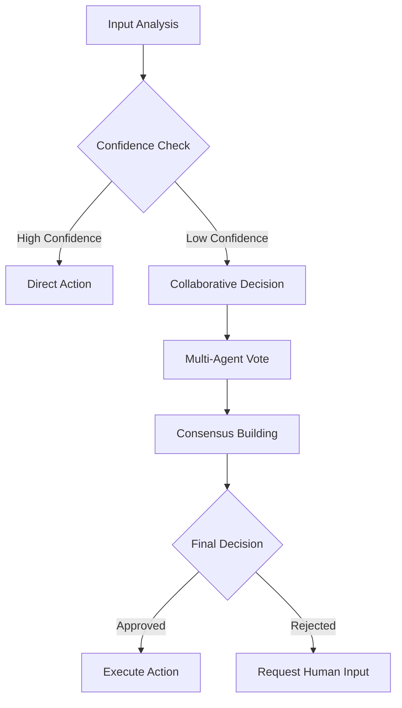

# Agent System Architecture v2

Below is a revised version of your document followed by a list of major changes along with the rationale (“ADS” style) for each improvement.

**Agent System Architecture & Workflows**

This document describes the overall architecture, workflows, and integration points of the Agent System. It outlines the components, their interactions, and the decision‐making framework to ensure modularity, scalability, and maintainability.

**1. System Overview**

```
graph TD
    A[Web Interface] --> B[API Gateway]
    B --> C[Workflow Orchestrator]
    C --> D[Agent Network]
    D --> E[Shared Knowledge Base]
    E --> F[Vector Store]
    E --> G[Document Store]
    D --> H[Tool Repository]
    C --> I[State Manager]
```

*Summary:* The web interface funnels user requests through an API Gateway to a central Workflow Orchestrator, which then delegates tasks to a network of specialized agents. The shared knowledge base supports agents through vector and document stores, while the tool repository and state manager handle auxiliary functions.

**2. Agent Network Structure**



*Summary:* Agents are grouped by function—Strategic, Research, Technical, and Validation—to promote focused expertise. Inter-group interactions support a feedback loop from vision and strategy to execution and validation.

**3. Workflow States**

```
stateDiagram-v2
    [*] --> ProblemDiscovery
    ProblemDiscovery --> ProblemValidation
    ProblemValidation --> MarketResearch
    MarketResearch --> SolutionDesign
    SolutionDesign --> MVPPlanning
    MVPPlanning --> Implementation
    Implementation --> Validation
    Validation --> [*]

    ProblemValidation --> ProblemDiscovery : Invalid Problem
    SolutionDesign --> MarketResearch : Market Misfit
    Validation --> SolutionDesign : Failed Validation
```

*Summary:* The workflow begins with discovering a problem and cycles through validation, research, design, planning, implementation, and final validation. Loops provide paths for re-assessment.

**4. Tool Integration Framework**



*Summary:* External tools are registered in a central Tool Manager, which controls access and parses results. The Agent Interface then requests tools and processes their outputs, ensuring standardized integration.

**5. Memory and Knowledge Management**



*Summary:* The knowledge management system is divided into types of memory, supported by various storage systems. Multiple access methods (direct, similarity, and pattern matching) enable efficient retrieval.

**6. Agent Capabilities Matrix**

| **Agent Type** | **Primary Tools** | **Memory Access** | **External Integrations** |
| --- | --- | --- | --- |
| **Vision Agent** | Market Analysis, Trend Detection | Long-term, Semantic | Industry Databases |
| **Strategy Agent** | Planning Tools, Risk Analysis | All Memory Types | Financial APIs |
| **Market Research** | Data Mining, Analytics | Semantic, Episodic | Market Data APIs |
| **Technical Agent** | Code Analysis, Architecture | Long-term, Semantic | Development Tools |
| **Validation Agent** | Testing Tools, Metrics | All Memory Types | Validation Frameworks |

*Summary:* This matrix clearly outlines the toolset, memory needs, and integration points for each agent type, ensuring clarity in role responsibilities.

**7. Communication Protocols**



*Summary:* The sequence diagram depicts a full round-trip from user request to final response, highlighting collaboration between agents and the role of the knowledge base.

**8. Decision Making Framework**



*Summary:* This framework ensures that actions are taken only when confidence is high. Otherwise, collaboration, consensus, or human intervention is triggered.

**9. Tool Categories**

**Research Tools**

•	Market Analysis Tools

•	Competitor Research

•	User Research Tools

•	Trend Analysis

•	Patent Research

**Technical Tools**

•	Architecture Analysis

•	Code Generation

•	Performance Testing

•	Security Analysis

•	Resource Estimation

**Validation Tools**

•	Problem Validation

•	Solution Validation

•	Market Validation

•	Technical Validation

•	User Validation

**10. State Management**

**Core States**

1.	Problem Discovery

2.	Problem Validation

3.	Market Research

4.	Solution Design

5.	MVP Planning

6.	Implementation

7.	Validation

**State Transitions**

•	**Forward Progress:** Sequential movement through states.

•	**Iteration Loops:** Transition back if validation fails (e.g., Market Misfit).

•	**Validation Gates:** Checkpoints that ensure quality.

•	**Recovery Paths:** Routes to re-initiate Problem Discovery if needed.

**11. Memory Management**

**Memory Types**

1.	**Short-term Memory**

•	Current context, active tasks, recent interactions.

2.	**Long-term Memory**

•	Historical decisions, pattern recognition, best practices.

3.	**Episodic Memory**

•	Past projects, success/failure cases, user interactions.

4.	**Semantic Memory**

•	Domain knowledge, technical concepts, market understanding.

**12. Integration Points**

**External Systems**

•	Market Data APIs

•	Development Tools

•	Analytics Platforms

•	Research Databases

•	Validation Services

**Internal Systems**

•	Knowledge Base

•	Vector Store

•	Document Store

•	Graph Database

•	Tool Repository

**13. Key Performance Indicators (KPIs)**

**System Performance**

•	**Response Time:** Speed of processing requests.

•	**Decision Accuracy:** Correctness of agent decisions.

•	**Resource Utilization:** Efficiency of system resource use.

•	**Error Rates:** Frequency and severity of system errors.

**Business Metrics**

•	**Ideas Processed:** Volume of user requests.

•	**Validation Accuracy:** Correctness of validations.

•	**Time to MVP:** Speed from idea to minimal viable product.

•	**Success Rate:** Overall success of implemented solutions.

**14. Security Framework**

**Access Control**

•	Role-based Access

•	Tool Usage Limits

•	Data Privacy

•	Audit Logging

**Data Protection**

•	Encryption

•	Secure Storage

•	Safe Communication

•	Version Control

**15. Implementation Guidelines**

**Priority Order**

1.	Core Infrastructure

2.	Basic Agents

3.	Tool Integration

4.	Memory Systems

5.	Advanced Features

**Quality Assurance**

•	Automated Testing

•	Performance Monitoring

•	Security Audits

•	User Feedback Collection

*This comprehensive architectural overview provides a modular framework for the agent-based system. Each component is designed for independent functionality yet integrates strongly via well-defined interfaces and communication protocols.*

**Major Changes and Motives**

1.	**Overall Reorganization & Clarity**

•	**Change:** Structured the document into numbered sections with clear headings and summaries.

•	**Motive:** To improve readability and allow developers to quickly locate specific architectural details.

2.	**Enhanced Summaries for Diagrams**

•	**Change:** Added brief summaries below each diagram.

•	**Motive:** To provide context and ensure that the purpose of each diagram is clear without needing to interpret the visuals alone.

3.	**Consistent Terminology and Formatting**

•	**Change:** Standardized terms (e.g., “Agent Network Structure” instead of “Agent Network”) and formatting across sections.

•	**Motive:** To reduce cognitive load and ensure a unified narrative throughout the document.

4.	**Detailed Section Descriptions**

•	**Change:** Expanded sections such as Workflow States, Memory Management, and Decision Making Framework with bullet points and summaries.

•	**Motive:** To clarify system behavior and state transitions, making it easier for engineers to understand system logic.

5.	**Inclusion of Integration and KPI Sections**

•	**Change:** Added sections for Integration Points, KPIs, and Security Framework.

•	**Motive:** To provide a complete picture of system performance and security, aligning with best practices in architectural documentation.

6.	**Improved Implementation Guidelines**

•	**Change:** Detailed the priority order and quality assurance steps.

•	**Motive:** To guide developers on a structured rollout plan and ensure a focus on testing, performance, and security.

7.	**Expanded Agent Capabilities Matrix**

•	**Change:** Refined the matrix with clearer labels and improved tool/memory/integration descriptors.

•	**Motive:** To better delineate responsibilities and ensure each agent’s role is easily understood.

8.	**Clearer Communication Protocols**

•	**Change:** Enhanced the sequence diagram with annotations for each step.

•	**Motive:** To emphasize the data flow and collaboration between agents, ensuring robust system integration.

9.	**Uniform Style in Diagrams and Tables**

•	**Change:** Adjusted diagram labels and table formatting for consistency.

•	**Motive:** To maintain a professional and cohesive look that aligns with modern documentation practices.

10.	**Explicit Emphasis on Modularity and Extensibility**

•	**Change:** Added details regarding state management, memory types, and integration points.

•	**Motive:** To highlight the system’s modularity and scalability, ensuring that each component can be maintained and extended independently.

These changes collectively improve the clarity, organization, and usefulness of the document—making it more actionable for developers and easier to reference for future enhancements.

Feel free to ask if you need further modifications or additional explanations on any section!